# 開発の手引き

CLAUDE.md から、ふだんは読まなくてよい、調べるときに見る部分を移したものです。決めごと（何をしてよいか）は CLAUDE.md にあり、ここには表、図、手順を置きます。

## 使っているライブラリ

使ってよい条件（商用で使える OSS、コピーレフトでない、ユーザーに確認してから足す）は、CLAUDE.md の「サードパーティーのライブラリ」にあります。

| パッケージ | 用途 | ライセンス |
|---|---|---|
| xunit.v3 | テスト | Apache-2.0 |
| Npgsql.EntityFrameworkCore.PostgreSQL | 本番の DB（PostgreSQL）とのやり取り（EF Core） | PostgreSQL |
| Npgsql | PostgreSQL のドライバー（上の部品が使う） | PostgreSQL |
| @microsoft/signalr（npm） | 画面のリアルタイム更新（SignalR のブラウザ側のクライアント。Microsoft 公式） | MIT |
| react、react-dom（npm） | 画面を作る | MIT |
| typescript（npm） | 画面の型の確かめ | Apache-2.0 |
| vite、@vitejs/plugin-react（npm） | 画面の開発用のサーバーとビルド | MIT |
| storybook、@storybook/react-vite（npm） | 画面の部品を1つずつ確かめる | MIT |
| @types/react、@types/react-dom（npm） | React の型 | MIT |
| tailwindcss、@tailwindcss/vite（npm） | 画面の見た目（CSS） | MIT |
| vitest（npm） | 画面のテスト | MIT |
| jsdom（npm） | 画面のテストで、ブラウザーの代わりをする | MIT |
| @playwright/test（npm） | 画面を本物のブラウザーで確かめる E2E テスト（Microsoft 製。依存の playwright、playwright-core も Apache-2.0） | Apache-2.0 |

- npm のパッケージは、依存しているものも含めてライセンスを確かめています。vite が CSS の処理に使う **lightningcss は MPL-2.0** です（ファイル単位の弱いコピーレフト）。ビルドの道具の中でだけ動き、配る成果物には入らず、手を加えずに使うので、使ってよいことにしています。
- @microsoft/signalr の依存先（Node.js で動かすときに使う ws、node-fetch、eventsource、fetch-cookie、tough-cookie など）も、MIT、BSD、Unlicense（パブリックドメイン相当）で、コピーレフトのものはありません。

## 開発の道具（VS Code）

- 開発は **VS Code** で行います。設定は `.vscode/`（`extensions.json`、`settings.json`、`launch.json`、`tasks.json`）と `.editorconfig` にあります。
  - デバッグは「Api + 画面」で、Api（http://localhost:5020）と画面（Vite の開発用のサーバー、http://localhost:5173 を Edge で）を一緒に起こします。
  - テスト、統合テスト、マイグレーションを作る、画面の型の確かめ・テスト・E2E・Storybook は、タスク（「タスクの実行」）から流せます。
  - `.editorconfig` には、書き方（字下げ、文字コード、行末の空白）だけを書きます。コード分析の指摘の重さやスタイルの規則は、ここで変えません（変えると、指摘を抑える特例と同じになるため）。
- 開発の道具にも、ライブラリと同じ条件（商用で使えること、商用の利用に条件がないこと）を当てはめます。
  - **C# Dev Kit（`ms-dotnettools.csdevkit`）は使いません**（商用の組織で使うには Visual Studio の契約が要るため）。C# のテストは、テストエクスプローラーではなく、タスクとターミナルから流します。
  - **Docker は使いません**（商用の利用に条件があるため）。統合テストの PostgreSQL は、ローカルに入れたものを使います。
  - TypeScript 7 の拡張機能（`typescriptteam.native-preview`）は、まだ試しの段階のため入れません。エディターの補完は VS Code に組み込みの TypeScript で、型の確かめは `npm run typecheck` で行います。

| 拡張機能 | 用途 | ライセンス |
|---|---|---|
| ms-dotnettools.csharp | C# の補完、デバッグ | MIT（同梱の言語サーバーとデバッガーは Microsoft のライセンス。VS Code などと一緒に使うこと、ほかへ配らないことが条件で、商用の開発に使えます） |
| ms-dotnettools.vscode-dotnet-runtime | .NET Install Tool（上の拡張機能と一緒に入る） | MIT |
| vitest.explorer | 画面のテストを、エディターから流す | MIT |
| ms-playwright.playwright | E2E テストを流す、デバッグする | Apache-2.0 |
| bradlc.vscode-tailwindcss | Tailwind のクラスの補完 | MIT |
| editorconfig.editorconfig | `.editorconfig` に従わせる | MIT |

開発のときのつながり：

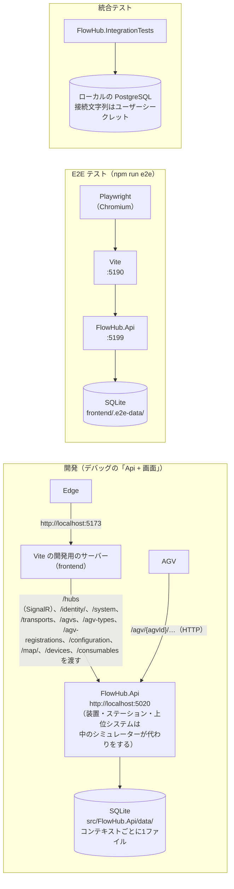
```mermaid
flowchart LR
    subgraph dev["開発（デバッグの「Api + 画面」）"]
        Edge["Edge"] -->|"http://localhost:5173"| Vite["Vite の開発用のサーバー<br/>（frontend）"]
        Vite -->|"/hubs（SignalR）、/identity/、/system、<br/>/transports、/agvs、/agv-types、<br/>/agv-registrations、/configuration、<br/>/map/、/devices、/consumables を渡す"| Api["FlowHub.Api<br/>http://localhost:5020<br/>（装置・ステーション・上位システムは<br/>中のシミュレーターが代わりをする）"]
        AGV["AGV"] -->|"/agv/{agvId}/…（HTTP）"| Api
        Api --> Sqlite[("SQLite<br/>src/FlowHub.Api/data/<br/>コンテキストごとに1ファイル")]
    end
    subgraph e2e["E2E テスト（npm run e2e）"]
        Chromium["Playwright<br/>（Chromium）"] --> ViteE2E["Vite<br/>:5190"] --> ApiE2E["FlowHub.Api<br/>:5199"] --> SqliteE2E[("SQLite<br/>frontend/.e2e-data/")]
    end
    subgraph it["統合テスト"]
        IntegrationTests["FlowHub.IntegrationTests"] --> Postgres[("ローカルの PostgreSQL<br/>接続文字列はユーザーシークレット")]
    end
```

## 初回起動の設定

初期設定が済んでいない環境では、API を起動する前に導入担当者が ASP.NET Core の設定 `Identity:SetupPassword`（環境変数名は `Identity__SetupPassword`）に設置先専用のパスワードを設定します。設定値はリポジトリに保存しません。

画面の `/setup` を開きます（開発時は `http://localhost:5173/setup`）。初期設定 API のパスは `/identity/setup/` で始まります。本番の画面と API は HTTPS で提供します。

作成した管理者は `/login` からログインします。通常ログインの API は `/identity/user/` です。初回変更で必要な文字数は `Identity:MinimumPasswordLength`（初期値8）、管理者の無操作期限は `Identity:Administrator:IdleTimeout`（初期値8時間）で設定できます。

通常ログイン後、メニューの「ユーザーとロールの管理」（`/#/users`）を開くと、画面が `GET /identity/user/users` と `GET /identity/user/roles` から一覧を読みます。

管理者が「ユーザーを加える」を選んだときの流れです。

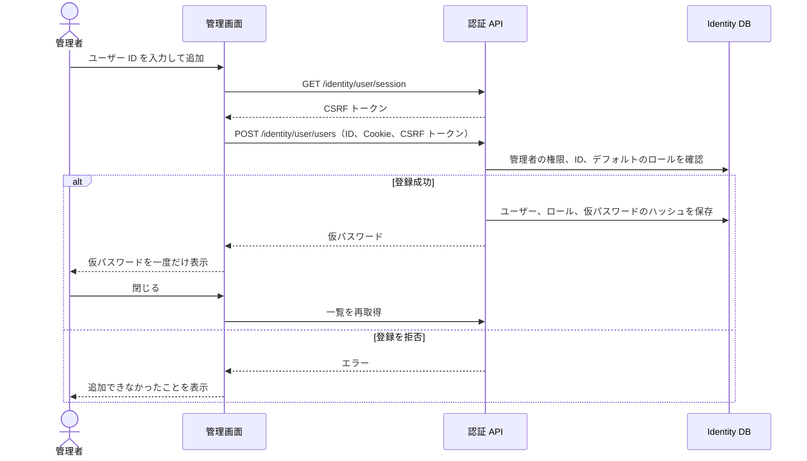
```mermaid
sequenceDiagram
    actor Admin as 管理者
    participant UI as 管理画面
    participant API as 認証 API
    participant DB as Identity DB
    Admin->>UI: ユーザー ID を入力して追加
    UI->>API: GET /identity/user/session
    API-->>UI: CSRF トークン
    UI->>API: POST /identity/user/users（ID、Cookie、CSRF トークン）
    API->>DB: 管理者の権限、ID、デフォルトのロールを確認
    alt 登録成功
        API->>DB: ユーザー、ロール、仮パスワードのハッシュを保存
        API-->>UI: 仮パスワード
        UI-->>Admin: 仮パスワードを一度だけ表示
        Admin->>UI: 閉じる
        UI->>API: 一覧を再取得
    else 登録を拒否
        API-->>UI: エラー
        UI-->>Admin: 追加できなかったことを表示
    end
```

ロール欄で選択したときの流れです。同時変更はサーバーが保存する順に反映します。

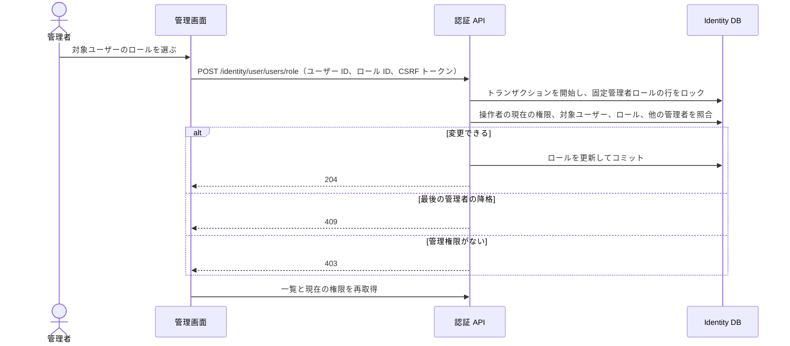
```mermaid
sequenceDiagram
    actor Admin as 管理者
    participant UI as 管理画面
    participant API as 認証 API
    participant DB as Identity DB
    Admin->>UI: 対象ユーザーのロールを選ぶ
    UI->>API: POST /identity/user/users/role（ユーザー ID、ロール ID、CSRF トークン）
    API->>DB: トランザクションを開始し、固定管理者ロールの行をロック
    API->>DB: 操作者の現在の権限、対象ユーザー、ロール、他の管理者を照合
    alt 変更できる
        API->>DB: ロールを更新してコミット
        API-->>UI: 204
    else 最後の管理者の降格
        API-->>UI: 409
    else 管理権限がない
        API-->>UI: 403
    end
    UI->>API: 一覧と現在の権限を再取得
```

通常ログインの無操作期限は、認証 Cookie を受けたリクエストごとに現在のロールで判定します。画面は SignalR のロングポーリングを使います。更新データが届かないときもサーバーは最長15秒でポーリングを返し、クライアントが次の要求を送るため、接続維持も期限の延長に含まれます。

管理者が「ロックを外す」を押したときの流れです。

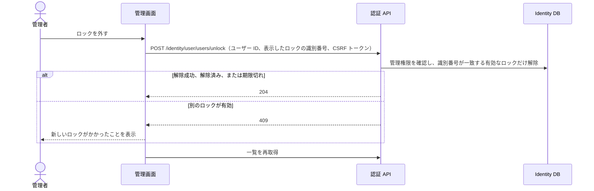
```mermaid
sequenceDiagram
    actor Admin as 管理者
    participant UI as 管理画面
    participant API as 認証 API
    participant DB as Identity DB
    Admin->>UI: ロックを外す
    UI->>API: POST /identity/user/users/unlock（ユーザー ID、表示したロックの識別番号、CSRF トークン）
    API->>DB: 管理権限を確認し、識別番号が一致する有効なロックだけ解除
    alt 解除成功、解除済み、または期限切れ
        API-->>UI: 204
    else 別のロックが有効
        API-->>UI: 409
        UI-->>Admin: 新しいロックがかかったことを表示
    end
    UI->>API: 一覧を再取得
```

他のユーザーの仮パスワードを再発行するときの流れです。

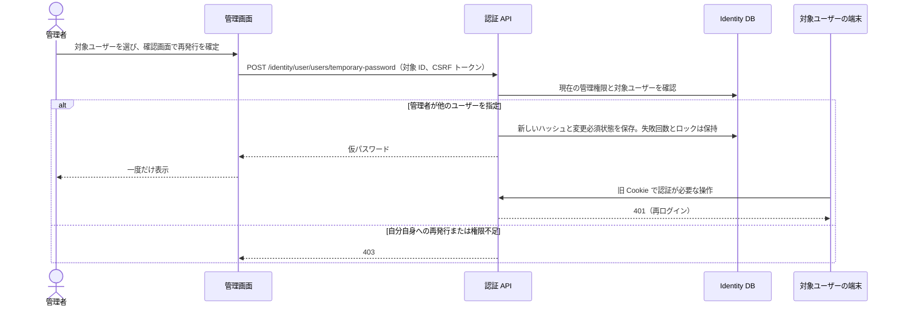
```mermaid
sequenceDiagram
    actor Admin as 管理者
    participant UI as 管理画面
    participant API as 認証 API
    participant DB as Identity DB
    participant Client as 対象ユーザーの端末
    Admin->>UI: 対象ユーザーを選び、確認画面で再発行を確定
    UI->>API: POST /identity/user/users/temporary-password（対象 ID、CSRF トークン）
    API->>DB: 現在の管理権限と対象ユーザーを確認
    alt 管理者が他のユーザーを指定
        API->>DB: 新しいハッシュと変更必須状態を保存。失敗回数とロックは保持
        API-->>UI: 仮パスワード
        UI-->>Admin: 一度だけ表示
        Client->>API: 旧 Cookie で認証が必要な操作
        API-->>Client: 401（再ログイン）
    else 自分自身への再発行または権限不足
        API-->>UI: 403
    end
```

本人がメニューからパスワードを変えるときは、通常ログインの変更画面（`/login?change-password`）を開きます。

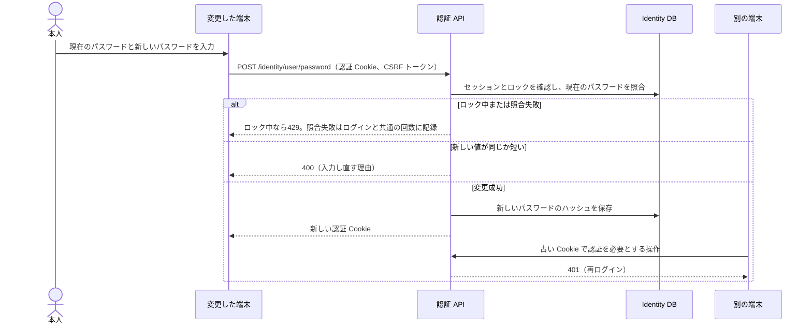
```mermaid
sequenceDiagram
    actor User as 本人
    participant UI as 変更した端末
    participant API as 認証 API
    participant DB as Identity DB
    participant Other as 別の端末
    User->>UI: 現在のパスワードと新しいパスワードを入力
    UI->>API: POST /identity/user/password（認証 Cookie、CSRF トークン）
    API->>DB: セッションとロックを確認し、現在のパスワードを照合
    alt ロック中または照合失敗
        API-->>UI: ロック中なら429。照合失敗はログインと共通の回数に記録
    else 新しい値が同じか短い
        API-->>UI: 400（入力し直す理由）
    else 変更成功
        API->>DB: 新しいパスワードのハッシュを保存
        API-->>UI: 新しい認証 Cookie
        Other->>API: 古い Cookie で認証を必要とする操作
        API-->>Other: 401（再ログイン）
    end
```

ロールの追加と編集は、同じ API で保存します。

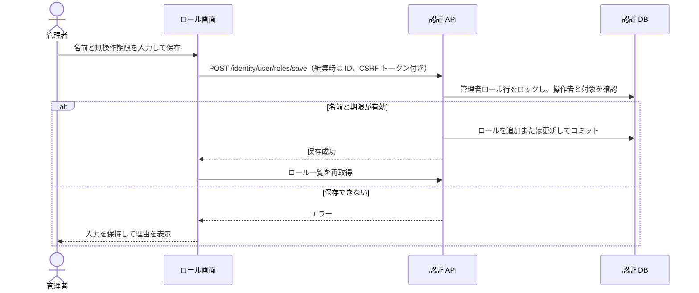
```mermaid
sequenceDiagram
    actor A as 管理者
    participant UI as ロール画面
    participant API as 認証 API
    participant DB as 認証 DB
    A->>UI: 名前と無操作期限を入力して保存
    UI->>API: POST /identity/user/roles/save（編集時は ID、CSRF トークン付き）
    API->>DB: 管理者ロール行をロックし、操作者と対象を確認
    alt 名前と期限が有効
        API->>DB: ロールを追加または更新してコミット
        API-->>UI: 保存成功
        UI->>API: ロール一覧を再取得
    else 保存できない
        API-->>UI: エラー
        UI-->>A: 入力を保持して理由を表示
    end
```

管理画面は `GET /identity/user/account` の `userId` と `permissions` で、操作中のユーザーと管理権限を確認します。サーバーは要求ごとにユーザーと現在のロールを照合し、そのロールのパーミッションを返します。

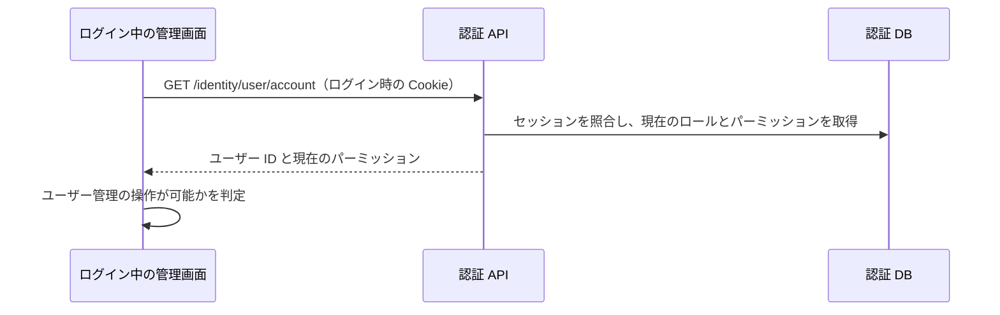
```mermaid
sequenceDiagram
    participant UI as ログイン中の管理画面
    participant API as 認証 API
    participant DB as 認証 DB
    UI->>API: GET /identity/user/account（ログイン時の Cookie）
    API->>DB: セッションを照合し、現在のロールとパーミッションを取得
    API-->>UI: ユーザー ID と現在のパーミッション
    UI->>UI: ユーザー管理の操作が可能かを判定
```

業務画面では操作の HTTP 応答、SignalR の接続交渉とロングポーリングの応答で認証失効を検出します。

画面用ハブ `/hubs/screen` は通常のユーザー Cookie と初回パスワード変更済みの状態を要求します。接続交渉と各ポーリング要求で同じ認可ポリシーを使います。サーバーが提供する転送方式はロングポーリングです。未認証または初期設定専用の Cookie だけの場合は 401、仮パスワードの変更待ちは 403 です。

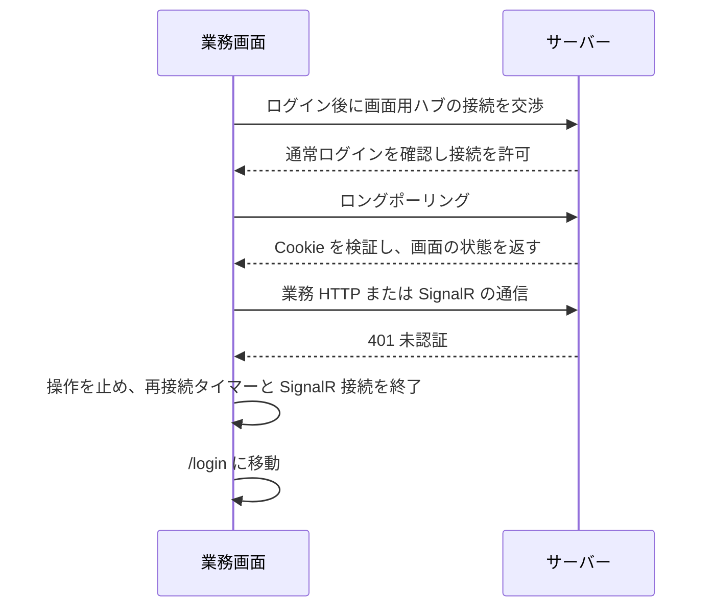
```mermaid
sequenceDiagram
    participant UI as 業務画面
    participant API as サーバー
    UI->>API: ログイン後に画面用ハブの接続を交渉
    API-->>UI: 通常ログインを確認し接続を許可
    UI->>API: ロングポーリング
    API-->>UI: Cookie を検証し、画面の状態を返す
    UI->>API: 業務 HTTP または SignalR の通信
    API-->>UI: 401 未認証
    UI->>UI: 操作を止め、再接続タイマーと SignalR 接続を終了
    UI->>UI: /login に移動
```

運転状態の取得（`GET /system/status`）には通常ログインが必要です。スタートと停止は次の順番で受け付けます。

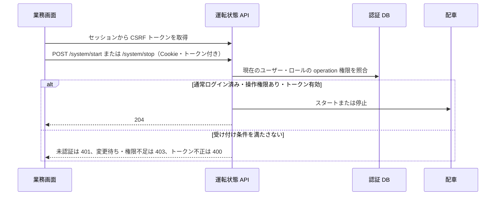
```mermaid
sequenceDiagram
    participant UI as 業務画面
    participant API as 運転状態 API
    participant DB as 認証 DB
    participant D as 配車
    UI->>API: セッションから CSRF トークンを取得
    UI->>API: POST /system/start または /system/stop（Cookie・トークン付き）
    API->>DB: 現在のユーザー・ロールの operation 権限を照合
    alt 通常ログイン済み・操作権限あり・トークン有効
        API->>D: スタートまたは停止
        API-->>UI: 204
    else 受け付け条件を満たさない
        API-->>UI: 未認証は 401、変更待ち・権限不足は 403、トークン不正は 400
    end
```

搬送の取りやめでは、サーバーが現在の権限を確認してから搬送番号を配車へ渡します。

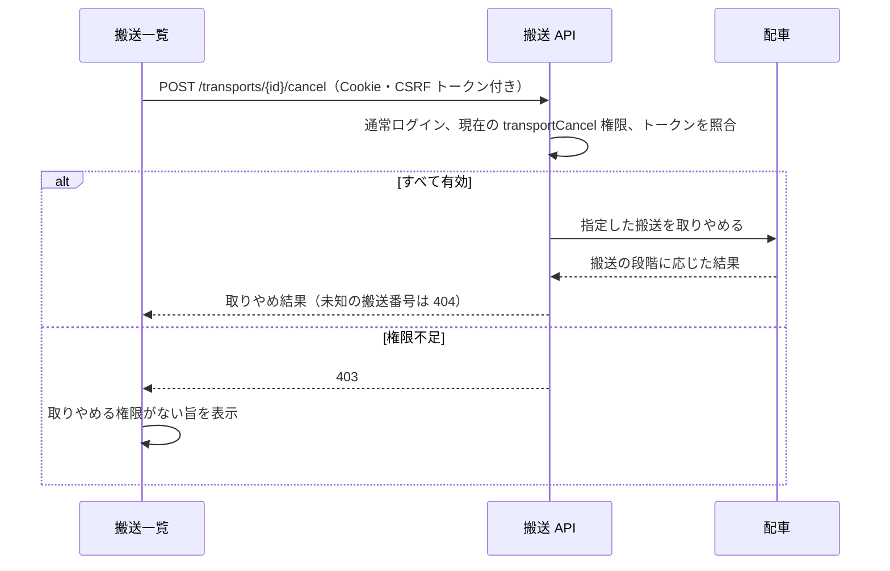
```mermaid
sequenceDiagram
    participant UI as 搬送一覧
    participant API as 搬送 API
    participant D as 配車
    UI->>API: POST /transports/{id}/cancel（Cookie・CSRF トークン付き）
    API->>API: 通常ログイン、現在の transportCancel 権限、トークンを照合
    alt すべて有効
        API->>D: 指定した搬送を取りやめる
        D-->>API: 搬送の段階に応じた結果
        API-->>UI: 取りやめ結果（未知の搬送番号は 404）
    else 権限不足
        API-->>UI: 403
        UI->>UI: 取りやめる権限がない旨を表示
    end
```

ストッカー設定の保存では、画面を開いた後に変更された権限も反映します。

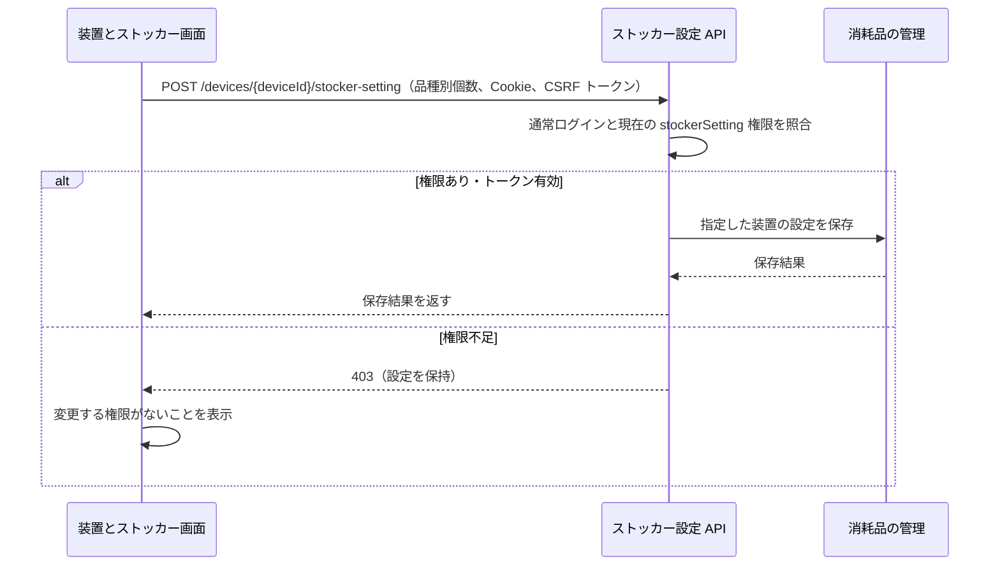
```mermaid
sequenceDiagram
    participant UI as 装置とストッカー画面
    participant API as ストッカー設定 API
    participant C as 消耗品の管理
    UI->>API: POST /devices/{deviceId}/stocker-setting（品種別個数、Cookie、CSRF トークン）
    API->>API: 通常ログインと現在の stockerSetting 権限を照合
    alt 権限あり・トークン有効
        API->>C: 指定した装置の設定を保存
        C-->>API: 保存結果
        API-->>UI: 保存結果を返す
    else 権限不足
        API-->>UI: 403（設定を保持）
        UI->>UI: 変更する権限がないことを表示
    end
```

消耗品の出庫・要確認の修正・指名・指名取消には消耗品操作権限、在庫の手入力（登録・修正・削除）には在庫手入力権限が必要です。どちらも画面を開いた後の権限変更を反映します。

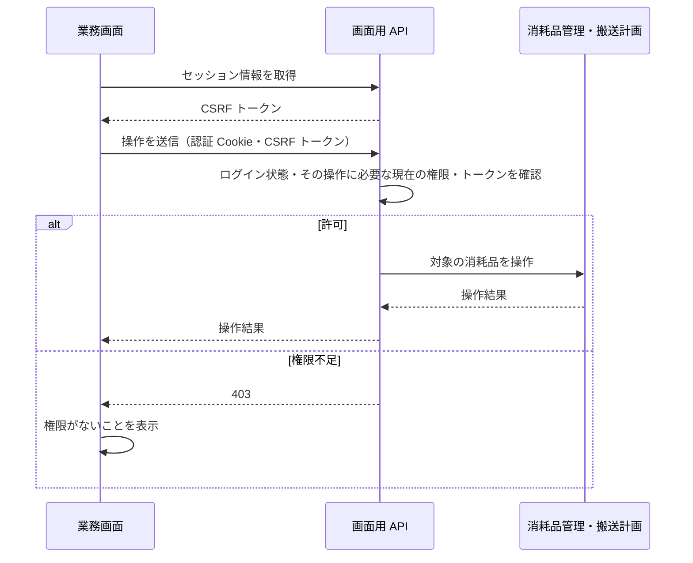
```mermaid
sequenceDiagram
    participant UI as 業務画面
    participant API as 画面用 API
    participant Service as 消耗品管理・搬送計画
    UI->>API: セッション情報を取得
    API-->>UI: CSRF トークン
    UI->>API: 操作を送信（認証 Cookie・CSRF トークン）
    API->>API: ログイン状態・その操作に必要な現在の権限・トークンを確認
    alt 許可
        API->>Service: 対象の消耗品を操作
        Service-->>API: 操作結果
        API-->>UI: 操作結果
    else 権限不足
        API-->>UI: 403
        UI->>UI: 権限がないことを表示
    end
```

マップ編集画面で下書きを開くときは、閲覧のみのロールでも通常ログインが済んでいれば取得できます。

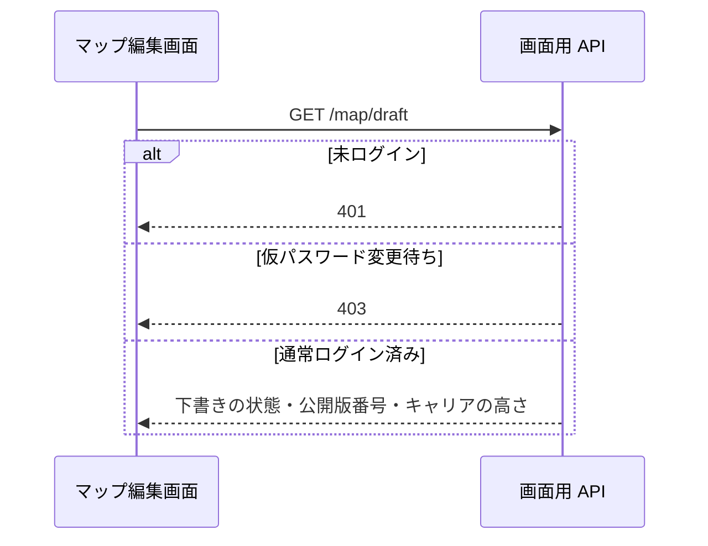
```mermaid
sequenceDiagram
    participant UI as マップ編集画面
    participant API as 画面用 API
    UI->>API: GET /map/draft
    alt 未ログイン
        API-->>UI: 401
    else 仮パスワード変更待ち
        API-->>UI: 403
    else 通常ログイン済み
        API-->>UI: 下書きの状態・公開版番号・キャリアの高さ
    end
```

マップの下書きは、保存・検証・公開のたびに現在の編集権限を確認します。検証後に権限が外れた場合も、公開時に拒否します。

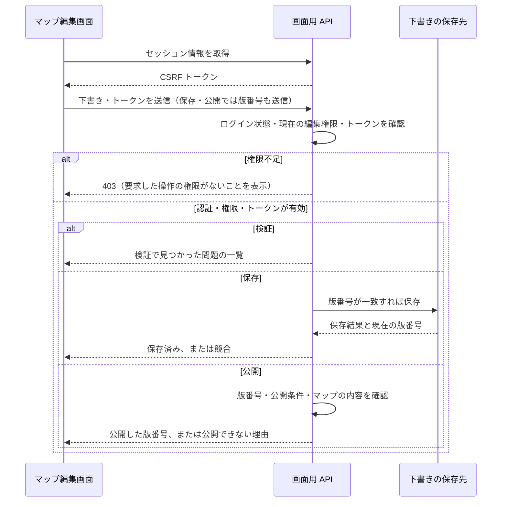
```mermaid
sequenceDiagram
    participant UI as マップ編集画面
    participant API as 画面用 API
    participant Store as 下書きの保存先
    UI->>API: セッション情報を取得
    API-->>UI: CSRF トークン
    UI->>API: 下書き・トークンを送信（保存・公開では版番号も送信）
    API->>API: ログイン状態・現在の編集権限・トークンを確認
    alt 権限不足
        API-->>UI: 403（要求した操作の権限がないことを表示）
    else 認証・権限・トークンが有効
        alt 検証
            API-->>UI: 検証で見つかった問題の一覧
        else 保存
            API->>Store: 版番号が一致すれば保存
            Store-->>API: 保存結果と現在の版番号
            API-->>UI: 保存済み、または競合
        else 公開
            API->>API: 版番号・公開条件・マップの内容を確認
            API-->>UI: 公開した版番号、または公開できない理由
        end
    end
```

キャリアの高さは公開中の版の受け渡しパネルに設定します。高さを消すときも同じ権限を確認します。

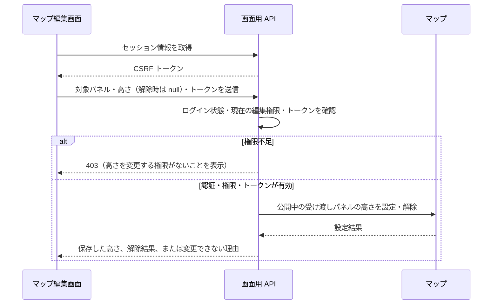
```mermaid
sequenceDiagram
    participant UI as マップ編集画面
    participant API as 画面用 API
    participant Map as マップ
    UI->>API: セッション情報を取得
    API-->>UI: CSRF トークン
    UI->>API: 対象パネル・高さ（解除時は null）・トークンを送信
    API->>API: ログイン状態・現在の編集権限・トークンを確認
    alt 権限不足
        API-->>UI: 403（高さを変更する権限がないことを表示）
    else 認証・権限・トークンが有効
        API->>Map: 公開中の受け渡しパネルの高さを設定・解除
        Map-->>API: 設定結果
        API-->>UI: 保存した高さ、解除結果、または変更できない理由
    end
```

画面から AGV 本体や種類を登録・変更・削除するときは、送信時点で構成を変更する権限があるかを確認します。交通整理と配車で AGV の登録が食い違い、「登録をそろえる」を選んだ場合も同じ流れです。

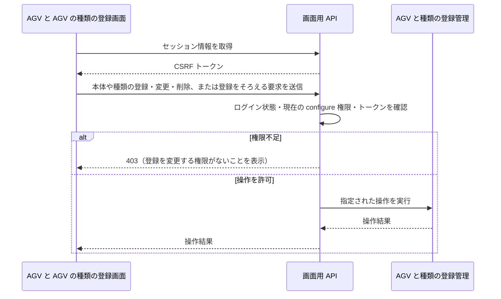
```mermaid
sequenceDiagram
    participant UI as AGV と AGV の種類の登録画面
    participant API as 画面用 API
    participant Catalog as AGV と種類の登録管理
    UI->>API: セッション情報を取得
    API-->>UI: CSRF トークン
    UI->>API: 本体や種類の登録・変更・削除、または登録をそろえる要求を送信
    API->>API: ログイン状態・現在の configure 権限・トークンを確認
    alt 権限不足
        API-->>UI: 403（登録を変更する権限がないことを表示）
    else 操作を許可
        API->>Catalog: 指定された操作を実行
        Catalog-->>API: 操作結果
        API-->>UI: 操作結果
    end
```

消耗品の構成画面では、加工の種類・品種・入庫の予定・装置・ステーションを変更するたびに、現在の権限を確認します。

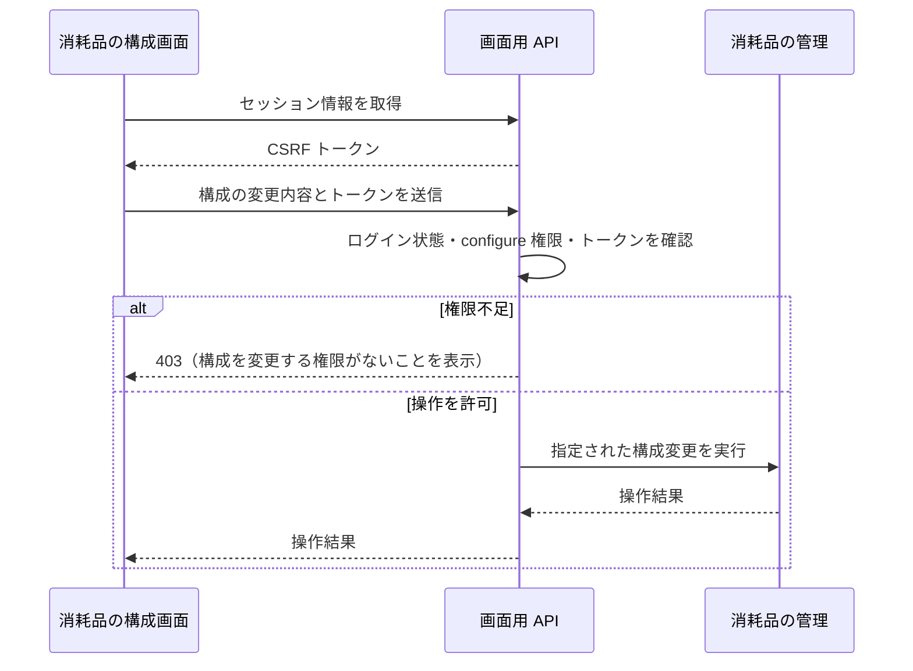
```mermaid
sequenceDiagram
    participant UI as 消耗品の構成画面
    participant API as 画面用 API
    participant Service as 消耗品の管理
    UI->>API: セッション情報を取得
    API-->>UI: CSRF トークン
    UI->>API: 構成の変更内容とトークンを送信
    API->>API: ログイン状態・configure 権限・トークンを確認
    alt 権限不足
        API-->>UI: 403（構成を変更する権限がないことを表示）
    else 操作を許可
        API->>Service: 指定された構成変更を実行
        Service-->>API: 操作結果
        API-->>UI: 操作結果
    end
```

パーミッション表の保存では、各チェックの変更先の値をサーバーに渡します。

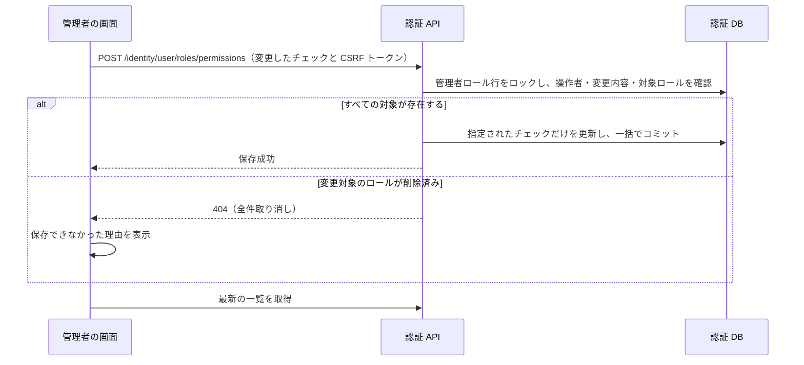
```mermaid
sequenceDiagram
    participant UI as 管理者の画面
    participant API as 認証 API
    participant DB as 認証 DB
    UI->>API: POST /identity/user/roles/permissions（変更したチェックと CSRF トークン）
    API->>DB: 管理者ロール行をロックし、操作者・変更内容・対象ロールを確認
    alt すべての対象が存在する
        API->>DB: 指定されたチェックだけを更新し、一括でコミット
        API-->>UI: 保存成功
    else 変更対象のロールが削除済み
        API-->>UI: 404（全件取り消し）
        UI->>UI: 保存できなかった理由を表示
    end
    UI->>API: 最新の一覧を取得
```

ロール一覧から新規ユーザーのデフォルトを変更する流れです。

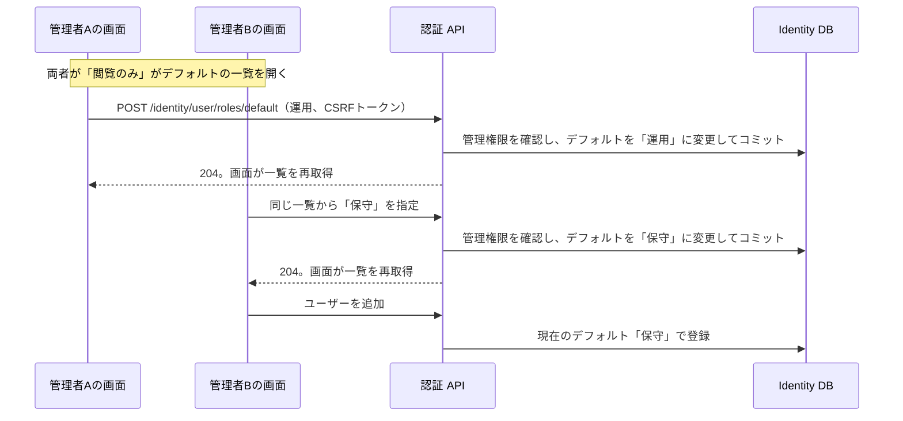
```mermaid
sequenceDiagram
    participant A as 管理者Aの画面
    participant B as 管理者Bの画面
    participant API as 認証 API
    participant DB as Identity DB
    Note over A,B: 両者が「閲覧のみ」がデフォルトの一覧を開く
    A->>API: POST /identity/user/roles/default（運用、CSRFトークン）
    API->>DB: 管理権限を確認し、デフォルトを「運用」に変更してコミット
    API-->>A: 204。画面が一覧を再取得
    B->>API: 同じ一覧から「保守」を指定
    API->>DB: 管理権限を確認し、デフォルトを「保守」に変更してコミット
    API-->>B: 204。画面が一覧を再取得
    B->>API: ユーザーを追加
    API->>DB: 現在のデフォルト「保守」で登録
```

ロールを削除するときは、確認画面を開いてから変わる可能性がある条件をサーバーでも調べます。

```mermaid
sequenceDiagram
    actor Admin as 管理者
    participant UI as 管理画面
    participant API as 認証 API
    participant DB as Identity DB
    Admin->>UI: ロール名を確認して削除を確定
    UI->>API: POST /identity/user/roles/delete（ロール ID、CSRF トークン）
    API->>DB: 管理権限を確認し、ユーザー追加・ロール変更と削除を直列に処理
    alt 未使用で、固定でもデフォルトでもない
        API->>DB: ロールと対応するパーミッションを削除してコミット
        API-->>UI: 204
    else 削除条件を満たさない
        API-->>UI: 409
    else 対象がすでに存在しない
        API-->>UI: 204（削除済み）
    end
    UI->>API: 一覧を再取得
```

## 新しい機能をどこに置くか

新しい機能を、別のプロジェクト（コンテキスト）に分けるか、既存のプロジェクトに足すかは、次の指標で決めます。

**分ける理由**（どれか1つでも当てはまれば、別のプロジェクトにする）

| 問い | 例 |
|---|---|
| **取り外したり、差し替えたりする単位か**。将来、別のものに置き換える、なくす、両立させる見込みがあるか | ルーティングと全台の経路の計画（既存システムのルート計算に差し替える）。消耗品の管理（ワーク管理と入れ替える、両立させる） |
| **入れると、依存の向きが崩れるか**。知るべきでない相手を知る、矢印が逆を向く、輪になる | 画面のメッセージ（どのコンテキストに入れても、ほかのコンテキストのイベントを知ることになる）。配車は運ぶものを知らない |
| **自分の状態と DB のスキーマを持ち、変わる理由が違うか**。変える人、変える頻度、版の考え方が違う | マップ（版のスナップショット。編集するのは管理者）と交通整理（走っている間に刻々と変わる） |
| **同じ言葉が、違う意味になるか**。入れると、1つの型に2つの意味が混ざる | 「予約」は、交通整理ではパネル、消耗品の管理では届ける消耗品 |

**足す理由**（こちらが強ければ、既存のプロジェクトに足す）

| 問い | 例 |
|---|---|
| **既存の集約の状態を、同じロックや同じトランザクションで読み書きするか**。分けると、結果整合やイベントの往復が要るようになる | 段取り替え（ストッカーの設定と在庫を一緒に見る）は、消耗品の管理に足した |
| **既存のコンテキストの言葉だけで説明できるか** | 指名（AGV での交換）は、消耗品の管理の言葉で説明できる |
| **分けても、公開インターフェースが広がるだけか**。差し替える見込みがない | マニュアル操作は、交通整理に足した |

**あいだの選び方**：分ける理由がまだ確かでないとき（仕様が固まっていないときなど）は、**同じプロジェクトの中で、インターフェース（ポート）とフォルダで切り離して** おき、理由が確かになったら外に出します（例：ステーション）。

**組み立てでつなぐだけのもの**：状態を持たず、あるコンテキストのイベントを別の形に変えて渡すだけなら、プロジェクトにせず、組み立て（`FlowHub.Api`）の購読者にします（例：イベントを文にして、画面のメッセージに渡す）。状態を持つようになったら、分ける理由に当てはまるかを考え直します（画面のメッセージは「DB に残す」が加わって、`FlowHub.Notifications` に分けた）。

**判断の順番**
1. 組み立てでつなぐだけで済むかを見る。
2. 分ける理由に当てはまるかを見る。当てはまらなければ、既存のプロジェクトに足す。
3. 迷ったら、まず同じプロジェクトの中で切り離しておく。分けるのはあとからでもできるが、まとめ直すのは高くつくため。
4. 分けると決めたら、CLAUDE.md のコンテキストの表、依存の向きの表、ディレクトリと、アーキテクチャテスト（`tests/FlowHub.ArchitectureTests` の `ContextRules`）を、一緒に直す。
- 分けるか足すかは、構成の決めごとなので、ユーザーに確認してから決めます。

## ディレクトリ

```
src/
  FlowHub.BuildingBlocks/
  FlowHub.Map/
  FlowHub.Routing/
  FlowHub.PathPlanning/
  FlowHub.Notifications/
  FlowHub.Identity/
  FlowHub.Traffic/
  FlowHub.Dispatching/
  FlowHub.ToolPlanning/
  FlowHub.Consumables/
  FlowHub.Simulator/
  FlowHub.Api/
tests/
  FlowHub.Api.Tests/
  FlowHub.BuildingBlocks.Tests/
  FlowHub.Map.Tests/
  FlowHub.Routing.Tests/
  FlowHub.PathPlanning.Tests/
  FlowHub.Notifications.Tests/
  FlowHub.Identity.Tests/
  FlowHub.Traffic.Tests/
  FlowHub.Dispatching.Tests/
  FlowHub.ToolPlanning.Tests/
  FlowHub.Consumables.Tests/
  FlowHub.Simulator.Tests/
  FlowHub.IntegrationTests/
  FlowHub.ArchitectureTests/
frontend/            （画面。React + TypeScript + Vite + Tailwind CSS + Vitest + Storybook）
```
